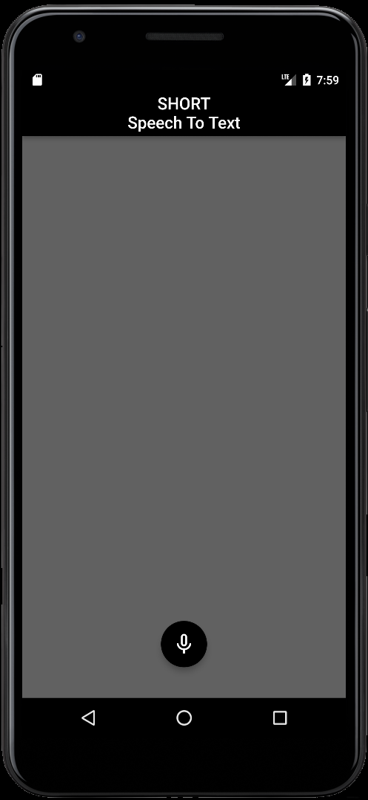

# Speech To Text

Package: [speech_to_text](https://pub.dev/packages/speech_to_text).

## Troubleshooting
**Speech recognition stops after a brief pause on Android**
Android speech recognition has a very short timeout when the speaker pauses.
The duration seems to vary by device and version of the Android OS.
In the devices I've used none have had a pause longer than 5 seconds.
Unfortunately there appears to be no way to change that behaviour.

## Continuous speech recognition
There have been a number of questions about how to achieve continuous speech recognition using this plugin.
**Currently the plugin is designed for short intermittent use, like when expecting a response to a question, or issuing a single voice command.**
Issue #63 is the current home for that discussion.
There is not yet a way to achieve this goal using the Android or iOS speech recognition capabilities.

## Speech recognition from recorded audio
There have been a number of questions about whether speech can be recognized from recorded audio. 
**The short answer is that this may be possible on iOS but doesn't appear to be on Android.**
There is an open issue on this here #205.

## SDK version error trying to compile for Android 
```
Manifest merger failed : uses-sdk:minSdkVersion 16 cannot be smaller than version 21 declared in library [:speech_to_text]
```
**The speech_to_text plugin requires at least Android SDK 21 because some of the speech functions in Android were only introduced in that version.**
To fix this error you need to change the build.gradle entry to reflect this version. 
Here's what the relevant part of that file looked like as of this writing:
```
    defaultConfig {
        applicationId "com.example.app"
        minSdkVersion 21
        targetSdkVersion 28
        versionCode flutterVersionCode.toInteger()
        versionName flutterVersionName
        testInstrumentationRunner "androidx.test.runner.AndroidJUnitRunner"
    }
```


